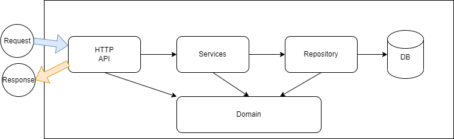
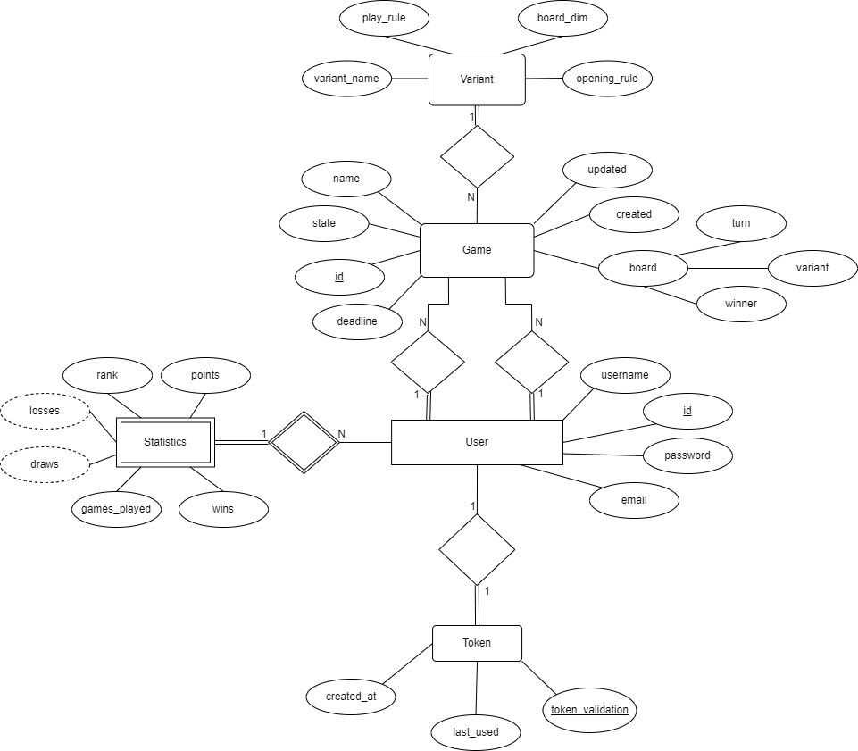

# Gomoku Royal - Backend Documentation

## Backend Application Architecture:

**The JVM application is organized as follows:**

+ [/domain](../code/jvm/src/main/kotlin/pt/isel/daw/gomoku/domain) - contains the domain classes of the application. These classes are used by the
repository, service layers and the HTTP layer;
+ [/http](../code/jvm/src/main/kotlin/pt/isel/daw/gomoku/http) - contains the HTTP layer of the application, implemented using Spring Web MVC;
+ [/repository](../code/jvm/src/main/kotlin/pt/isel/daw/gomoku/repository) - contains the repository layer of the application, implemented using Spring Data JDBI;
+ [/service](../code/jvm/src/main/kotlin/pt/isel/daw/gomoku/services) - contains the services that manage the business logic of the application;
+ [/utils](../code/jvm/src/main/kotlin/pt/isel/daw/gomoku/utils) - contains utility classes used by the application;

## Data model:

- **User** - Represents a user of the application. It has a:
  - `id`; 
  - `username`;
  - `password`;
  - `email`.
  
- **Statistic** - Represents a statistic of a user. It has a :
  - `number of wins`;
  - `number of losses`;
  - `number of played games`;
  - `rank`.
- **Game** - Represents a game of Gomoku. It has a 
  - `board`;
  - `creation date`;
  - `last update date`;
  - `deadline`;
  - `variant`;
  - `board` which stores the moves of the game, the player that made the move, the winner and variant.
- **Variant** - Represents a variant of the game. It has a :
  - `name`;
  - `board size`;
  - `an opening rule`;
  - `play rule`.
- **Token** - Represents a token of a user, used for authentication. It has a:
  - `creation date`;
  - `last access date`;
  - `token validation`.

## Physical Model:

The application uses a relational database to store the data. The database is a PostgreSQL database, and it's
available on [createSchema.sql](../code/jvm/src/sql/create-schema.sql) file.

On the [code/sql](../code/jvm/src/sql) directory is available 2 scripts:

- create-schema.sql - creates the database schema, tables, functions, triggers and initial data necessary;
- insert-data.sql - inserts test data into the database;

## Presentation layer:

The presentation layer is implemented using Spring Web MVC. The layer is composed of controllers that
are responsible for handling the HTTP requests and responses. The controllers are:

- **UserController** - handles the requests for the user resource;
- **GameController** - handles the requests for the game resource;

## Business layer:

The business layer is implemented using Spring. The layer is composed of services that are responsible
for handling the business logic of the application. It is responsible for managing the transactions
and the communication between the HTTP layer and the repository layer, each service is anotated with
`@Service` wich is interpreted by Spring as a service. The services are:

- **UserService** - handles the business logic for the user resource;
- **GameService** - handles the business logic for the game resource;

## Data layer:

The data layer is implemented using Spring Data JDBI. The layer is composed of repositories that
are responsible for handling the database operations. The repositories are:

- **UserRepository** - handles the database operations for the user resource;
- **GameRepository** - handles the database operations for the game resource;

## Error handling:

The application uses the Spring MVC error handling mechanism. The error handling is implemented
using the `@ControllerAdvice` annotation. The error handling is implemented in the
[ErrorController](../code/jvm/src/main/kotlin/pt/isel/daw/gomoku/http/CustomExceptionHandler.kt) class.

Also on the service layer is used sealed classes to handle the errors and return of each service
request, to have a better control of the errors and return of each service.

## Difficulties encountered:

+ Divide de logic of the application in layers;
+ Creating the data model;
+ Implementing the game logic. Most specifically, the functionality of the game with the creation of the variants;
+ Creating the http layer of the application(http routes);
+ Creating the tests for the application. Because of all the cases that the game can have;
+ Linking all backend components;